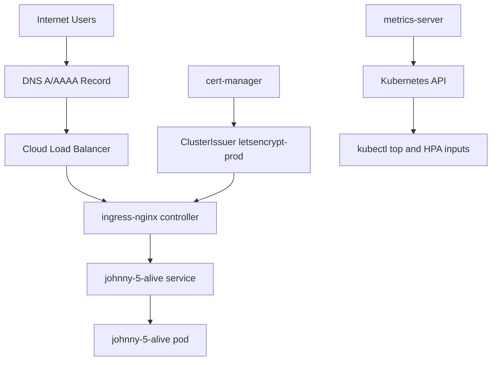

# Kube Me Up

Kube Me Up is a deterministic Kubernetes bootstrap workflow for getting from fresh cluster to live HTTPS traffic.

It is intentionally simple and script-driven: no custom controllers, no hidden control plane, just `kubectl`, `helm`, and `make` with an operator-safe flow.

## Why This Repo Exists

This repository is a reference implementation for senior and founding engineers who want infrastructure automation that is:

1. Safe to rerun (`helm upgrade --install`, preflight checks, readiness gates).
2. Easy to resume (`--skip-cluster`, `--skip-infra`, `--skip-issuer`, `--skip-app`).
3. Easy to inspect (`--dry-run` prints commands before any cluster mutation).
4. Scoped and honest (DOKS automation is built-in; other clouds are supported via existing-cluster path).

The workflow is designed to keep decisions explicit: trade-offs, operational boundaries, and execution steps are all visible in the commands and flags.

## What This Includes

1. Idempotent infrastructure install with Helm.
2. Separation of concerns between cluster provisioning, infrastructure, issuer, and app deployment.
3. Runtime overrides instead of mutating tracked manifests.
4. Readiness validation before claiming success.
5. Optional observability stack (Prometheus + Grafana).
6. Optional HPA configuration for the sample app.

## Architecture



## Design Choices and Trade-Offs

1. `ingress-nginx`: broad compatibility and straightforward operations for HTTP routing.
2. `cert-manager` with ACME HTTP-01: simple TLS automation, but requires public DNS to resolve correctly to ingress.
3. `metrics-server`: enables `kubectl top` and autoscaling signals with minimal setup.
4. `kube-prometheus-stack` (optional): adds historical metrics and dashboards, but increases cluster footprint.
5. Guided `install.sh` plus explicit flags: low-friction onboarding without hiding what runs.

Non-goal: this is not a full platform framework. It is a focused bootstrap workflow and operational baseline.

## Prerequisites

- `kubectl`
- `helm`
- `docker` (only for local Docker deploy mode)
- `make`
- `git`
- `doctl` (only for installer-managed DOKS cluster creation)

Cloud docs for manual cluster setup:

- GKE: https://cloud.google.com/kubernetes-engine/docs/deploy-app-cluster
- EKS: https://docs.aws.amazon.com/eks/latest/userguide/getting-started-eksctl.html
- DOKS: https://docs.digitalocean.com/products/kubernetes/how-to/create-clusters/

## Install Paths

### Path A: Existing Cluster (Recommended)

Run guided install:

```bash
chmod +x install.sh
./install.sh --use-existing-cluster
```

Non-interactive example:

```bash
./install.sh \
    --use-existing-cluster \
    --deploy-mode kubernetes \
    --with-observability \
    --enable-hpa \
    --domain alive.example.com \
    --email you@example.com
```

Preview without execution:

```bash
./install.sh --dry-run --use-existing-cluster
```

Resume after partial completion:

```bash
./install.sh --use-existing-cluster --skip-cluster --skip-infra --deploy-mode kubernetes
```

Enable optional observability only:

```bash
./install.sh --use-existing-cluster --with-observability --skip-app --deploy-mode skip
```

### Path B: DOKS Cluster Creation

The installer can create or reuse a DOKS cluster when `--use-existing-cluster` is not set.

```bash
./install.sh --cloud doks --cluster-name kube-me-up --region nyc3
```

For non-DOKS cluster creation, create cluster manually and rerun with `--use-existing-cluster`.

### Raw GitHub Script

```bash
curl -fsSL https://raw.githubusercontent.com/derekpedersen/kube-me-up/main/install.sh | bash
```

With flags:

```bash
curl -fsSL https://raw.githubusercontent.com/derekpedersen/kube-me-up/main/install.sh | bash -s -- --use-existing-cluster --deploy-mode kubernetes
```

## Operational Model

### Idempotency

Infrastructure and app deployment use `helm upgrade --install`, so reruns converge desired state instead of requiring teardown.

### Runtime Config Isolation

The installer generates temporary runtime files for ClusterIssuer and Helm overrides. Tracked files remain clean while deployment-specific values are injected at runtime.

### Readiness Gates

The installer waits on rollout status for ingress-nginx, cert-manager, metrics-server, and app deployment before printing success paths.

### Optional Observability

When enabled, the installer deploys Prometheus and Grafana with `kube-prometheus-stack` into the `monitoring` namespace.

### Optional HPA

When enabled in Kubernetes deploy mode, runtime Helm overrides set:

- `autoscaling.enabled=true`
- `autoscaling.minReplicas`
- `autoscaling.maxReplicas`
- `autoscaling.targetCPUUtilizationPercentage`

Flags:

- `--enable-hpa`
- `--hpa-min-replicas`
- `--hpa-max-replicas`
- `--hpa-target-cpu`

### Resume Controls

Use explicit skip flags to rerun only what you need:

- `--skip-cluster`
- `--skip-infra`
- `--skip-observability`
- `--skip-issuer`
- `--skip-app`

## Manual Fast Path

From repo root:

```bash
make helm-charts
kubectl apply -f cluster_issuer.yaml
helm upgrade --install johnny-5-alive johnny-5-alive/.helm
```

Validate:

```bash
kubectl get ingressclass nginx
kubectl get clusterissuer letsencrypt-prod
kubectl get pods -n cert-manager
kubectl get pods -l app.kubernetes.io/name=johnny-5-alive
```

## Deploy Modes

### Kubernetes

Deploy sample app through Helm into current kube context:

```bash
helm upgrade --install johnny-5-alive johnny-5-alive/.helm
```

Enable HPA through installer flags:

```bash
./install.sh \
    --use-existing-cluster \
    --deploy-mode kubernetes \
    --enable-hpa \
    --hpa-min-replicas 2 \
    --hpa-max-replicas 10 \
    --hpa-target-cpu 80 \
    --domain alive.example.com \
    --email you@example.com
```

### Docker

Run sample app locally without Kubernetes:

```bash
cd johnny-5-alive
make run
```

Endpoint: `http://localhost:9090`

### Skip

Install infrastructure and skip app deployment:

```bash
./install.sh --deploy-mode skip --use-existing-cluster
```

### Observability (Optional)

Install Prometheus + Grafana without changing app deployment:

```bash
./install.sh --use-existing-cluster --with-observability --deploy-mode skip --skip-app
```

Access Grafana locally:

```bash
kubectl port-forward svc/kube-prometheus-stack-grafana -n monitoring 3000:80
```

## Verification Checklist

```bash
kubectl get nodes
kubectl get svc -n ingress-nginx ingress-nginx-controller
kubectl get clusterissuer letsencrypt-prod
kubectl get ingress johnny-5-alive
kubectl get certificate -A
kubectl get challenges -A
kubectl top node
kubectl get hpa johnny-5-alive
kubectl get pods -n monitoring
kubectl get svc -n monitoring kube-prometheus-stack-grafana
kubectl get svc -n monitoring kube-prometheus-stack-prometheus
```

If DNS and domain are configured correctly, HTTPS should become healthy after ACME challenge completion.

## Troubleshooting

- Ingress has no address: check `ingress-nginx-controller` service type and allocation.
- Cert not issuing: confirm DNS points to ingress load balancer, then inspect `kubectl get challenges -A`.
- App unreachable: verify ingress host and TLS values used by runtime overrides.

Use the full runbook for recovery and deep diagnostics: [RUNBOOK.md](RUNBOOK.md).

## One-Liners

Cluster ready, deploy now:

```bash
./install.sh --use-existing-cluster --deploy-mode kubernetes
```

Full demo stack (infra + Prometheus/Grafana + issuer + app with HPA):

```bash
make install-full-observability EMAIL=you@example.com DOMAIN=alive.example.com
```

Optional HPA tuning for that target:

```bash
make install-full-observability \
    EMAIL=you@example.com \
    DOMAIN=alive.example.com \
    HPA_MIN_REPLICAS=2 \
    HPA_MAX_REPLICAS=12 \
    HPA_TARGET_CPU=75
```

Rerun app-only deploy:

```bash
./install.sh --use-existing-cluster --skip-cluster --skip-infra --skip-issuer --deploy-mode kubernetes
```
