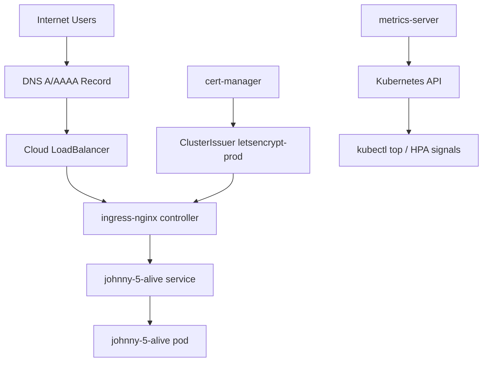

# Kube Me Up

Kube Me Up is a fast path from "fresh cluster" to "traffic is live".

Johnny 5 says: need input.
This repo says: give it a Kubernetes cluster, and it will wire ingress, TLS, metrics, and a sample app so you can prove the stack works.

## What This Installs

1. `ingress-nginx` for HTTP/HTTPS routing.
2. `cert-manager` + Let's Encrypt ClusterIssuer for automated TLS.
3. `metrics-server` for `kubectl top` and autoscaling inputs.
4. `johnny-5-alive` sample app deployed through Helm.

## Quick Start

Recommended path is the guided installer:

```bash
chmod +x install.sh
./install.sh
```

The script will prompt for cluster mode, domain, TLS email, and deployment mode.

Install directly from GitHub raw:

```bash
curl -fsSL https://raw.githubusercontent.com/derekpedersen/kube-me-up/main/install.sh | bash
```

Install from GitHub raw and pass flags:

```bash
curl -fsSL https://raw.githubusercontent.com/derekpedersen/kube-me-up/main/install.sh | bash -s -- --use-existing-cluster --deploy-mode kubernetes
```

Preview all actions without executing anything:

```bash
./install.sh --dry-run --use-existing-cluster
```

Resume from a partially completed environment with explicit step skips:

```bash
./install.sh --use-existing-cluster --skip-cluster --skip-infra --deploy-mode kubernetes
```

For full manual steps, use [RUNBOOK.md](RUNBOOK.md).

## Architecture



## Prerequisites

- `kubectl`
- `helm`
- `docker`
- `make`
- `git`
- `doctl` only if you want installer-managed DOKS cluster creation

Cloud docs for manual cluster setup:

- GKE: https://cloud.google.com/kubernetes-engine/docs/deploy-app-cluster
- EKS: https://docs.aws.amazon.com/eks/latest/userguide/getting-started-eksctl.html
- DOKS: https://docs.digitalocean.com/products/kubernetes/how-to/create-clusters/

## Manual Install (Fast Path)

From repo root:

```bash
make helm-charts
kubectl apply -f cluster_issuer.yaml
helm upgrade --install johnny-5-alive johnny-5-alive/.helm
```

Then verify:

```bash
kubectl get ingressclass nginx
kubectl get clusterissuer letsencrypt-prod
kubectl get pods -n cert-manager
kubectl get pods -l app.kubernetes.io/name=johnny-5-alive
```

## Deploy Modes

### Kubernetes Deploy

Deploy `johnny-5-alive` via Helm into your current kube context.

```bash
helm upgrade --install johnny-5-alive johnny-5-alive/.helm
```

### Local Docker Run

Run the sample app without Kubernetes:

```bash
cd johnny-5-alive
make run
```

App is reachable at `http://localhost:9090`.

## Configuration Points

- TLS issuer template: `cluster_issuer.yaml`
- App chart defaults: `johnny-5-alive/.helm/values.yaml`
- Infra install targets: `Makefile`

The installer generates runtime override manifests so your tracked files stay clean by default.

## Verification Checklist

```bash
kubectl get nodes
kubectl get svc -n ingress-nginx
kubectl get clusterissuer letsencrypt-prod
kubectl get ingress
kubectl top node
```

If you configured DNS + domain correctly, HTTPS should come online after the ACME challenge completes.

## Troubleshooting

- Ingress has no address: verify `ingress-nginx-controller` service is `LoadBalancer` and allocated.
- Cert not issuing: verify DNS points to load balancer and check `kubectl get challenges -A`.
- App not reachable: verify ingress host in chart values or installer overrides.

Detailed troubleshooting and recovery commands live in [RUNBOOK.md](RUNBOOK.md).

## One-Liner

When the cluster is ready and you want action:

```bash
./install.sh --use-existing-cluster --deploy-mode kubernetes
```

When you need to rerun only the app deploy:

```bash
./install.sh --use-existing-cluster --skip-cluster --skip-infra --skip-issuer --deploy-mode kubernetes
```

No disassemble. Only deploy.
